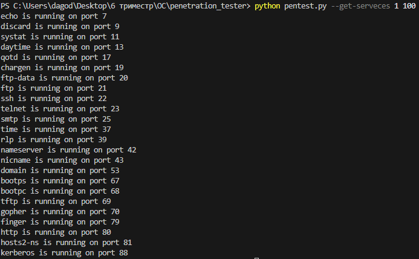

# Program for penetration testing
---
With this program, you can analyze ports to identify which services are running on specific ports, check whether a port is up or down, and perform brute force attacks on different services.

### Program usage
---
**Usage for check ports:**
&nbsp; &nbsp; &nbsp; &nbsp;  python pentest.py [option] [host] [port]
**Options:**
&nbsp; &nbsp; &nbsp; &nbsp;  -cp, --check-port &nbsp; &nbsp; &nbsp; &nbsp; Checks port
**Example:**
&nbsp; &nbsp; &nbsp; &nbsp;  `python pentest.py --check-port example.com 443`

**Usage for get port service:**
&nbsp; &nbsp; &nbsp; &nbsp;  python pentest.py [option] [first port] [last port]
**Options:**
&nbsp; &nbsp; &nbsp; &nbsp;  -gs, --get-services &nbsp; &nbsp; &nbsp; &nbsp; Gets services by ports
**Example:**
&nbsp; &nbsp; &nbsp; &nbsp;  `python pentest.py --get-services 1 100`

**Usage for brute force password:**
&nbsp; &nbsp; &nbsp; &nbsp;  python pentest.py [option] [url] [username]
**Options:**
&nbsp; &nbsp; &nbsp; &nbsp;  -bf, --brute-force-psswd &nbsp; &nbsp; &nbsp; &nbsp; Start brute force
**Example:**
&nbsp; &nbsp; &nbsp; &nbsp;  `python pentest.py -bf http://127.0.0.1:5000/login user`

### Program example of usages
---

